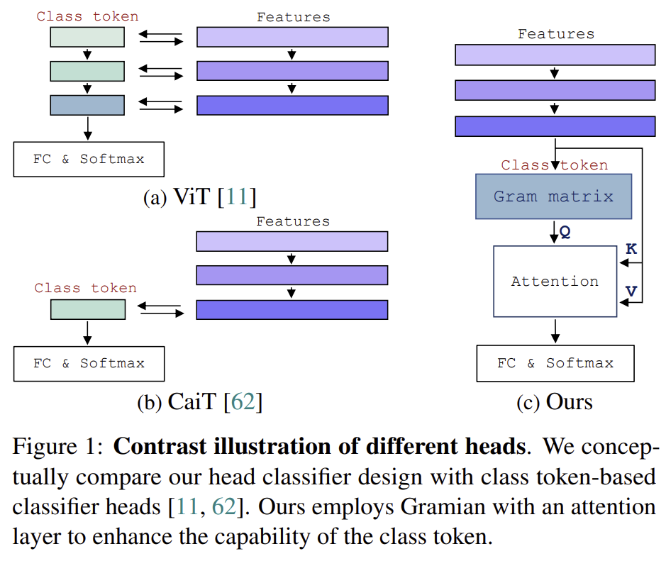
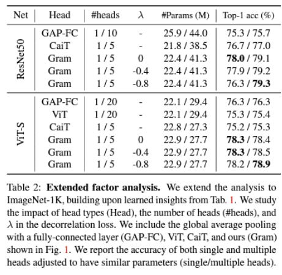
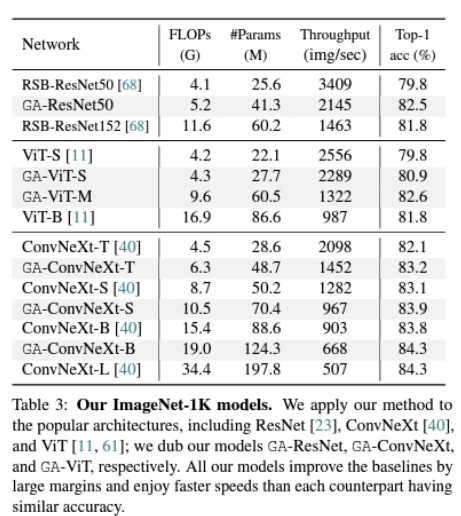

# Imagenet-models

## Gramian Attention Heads are Strong yet Efficient Vision Learners

Official implementation for "Gramian Attention Heads are Strong yet Efficient Vision Learners" ICCV 2023 [[paper]](https://openaccess.thecvf.com/content/ICCV2023/papers/Ryu_Gramian_Attention_Heads_are_Strong_yet_Efficient_Vision_Learners_ICCV_2023_paper.pdf)

After the paper was accepted, we improved our implementation, making the model faster and more performant.
We'll update this page soon with the our training results from the improved code.



### Requirement

`torch>=1.10.0`; `torchvision>=0.8.0`; `timm>=0.4.5`;
```
conda install -c pytorch pytorch torchvision 
pip install timm
```

### Training script

<details>
<summary>GA-ConvNext-T</summary>
 
```bash
python3 -m torch.distributed.launch --nproc_per_node=2 --master_port=12345 train.py your_imageNet_root -b 128 --grad-accumulation 4 --smoothing 0.1 --bce-loss --opt lamb --opt-eps 1e-8 --momentum 0.8 --weight-decay 0.05 --sched cosine --epochs 300 --lr 5e-3 --warmup-lr 1e-6 --sched cosine -j 8 --amp --channels-last --model ga_convnext_tiny --GA_lam -0.8 --drop-path .2
```

</details>

<details>
<summary>GA-ConvNext-S</summary>
 
```bash
python3 -m torch.distributed.launch --nproc_per_node=2 --master_port=12345 train.py your_imageNet_root -b 128 --grad-accumulation 4 --smoothing 0.1 --bce-loss --opt lamb --opt-eps 1e-8 --momentum 0.8 --weight-decay 0.05 --sched cosine --epochs 300 --lr 5e-3 --warmup-lr 1e-6 --sched cosine -j 8 --amp --channels-last --model ga_convnext_small --GA_lam -0.8 --drop-path .4
```

</details>

<details>
<summary>GA-ConvNext-B</summary>
 
```bash
python3 -m torch.distributed.launch --nproc_per_node=2 --master_port=12345 train.py your_imageNet_root -b 128 --grad-accumulation 4 --smoothing 0.1 --bce-loss --opt lamb --opt-eps 1e-8 --momentum 0.8 --weight-decay 0.05 --sched cosine --epochs 300 --lr 5e-3 --warmup-lr 1e-6 --sched cosine -j 8 --amp --channels-last --model ga_convnext_base --GA_lam -0.8 --drop-path .5
```

</details>

<details>
<summary>GA-CSWin-T</summary>
 
```bash
python3 -m torch.distributed.launch --nproc_per_node=2 --master_port=12341 train.py your_imageNet_root -b 128 --grad-accumulation 4 --smoothing 0.1 --bce-loss --opt lamb --opt-eps 1e-8 --momentum 0.8 --weight-decay 0.05 --sched cosine --epochs 300 --lr 2e-3 --warmup-lr 1e-6 --sched cosine -j 8 --amp --channels-last --model ga_CSWin_64_12211_tiny_224 --GA_lam -0.8 --drop-path .2
```
  
</details>

<details>
<summary>GA-CSWin-S</summary>
 
```bash
python3 -m torch.distributed.launch --nproc_per_node=2 --master_port=12341 train.py your_imageNet_root -b 128 --grad-accumulation 4 --smoothing 0.1 --bce-loss --opt lamb --opt-eps 1e-8 --momentum 0.8 --weight-decay 0.05 --sched cosine --epochs 300 --lr 2e-3 --warmup-lr 1e-6 --sched cosine -j 8 --amp --channels-last --model ga_CSWin_64_24322_small_224 --GA_lam -0.8 --drop-path .4
```

</details>

### Main experimental result

| Network | FLOPs (G) | Params (M) | Top-1 Acc.|
| ------- | --------- | ---------- | --------- | 
| GA-ResNet50 | 5.2 | 41.3 | 82.5 |
| GA-ViT-S | 4.3 | 27.7 | 80.9 |
| GA-ConvNext-Tiny | 6.3 | 48.7 | 83.2 |
| GA-ConvNext-Small | 10.5 | 70.4 | 83.9 |
| GA-ConvNext-Base | 19.0 | 124.3 | 84.3 |
| GA-CSwin-T | 6.1 | 42.0 | 84.1 |
| GA-CSwin-S | 8.7 | 54.3 | 84.7 |

### Ablation study

**Factor analysis for number of heads and training hyper parameter $\lambda$**

 

**Comparison with different backbone networks**



### Acknowledgement

We referenced the implementation of [Timm](https://github.com/huggingface/pytorch-image-models), [CaiT](https://github.com/facebookresearch/deit/blob/main/README_cait.md), [ConvNeXt](https://github.com/facebookresearch/ConvNeXt), and [CSWin](https://github.com/microsoft/CSWin-Transformer). Many thanks to the authors.
